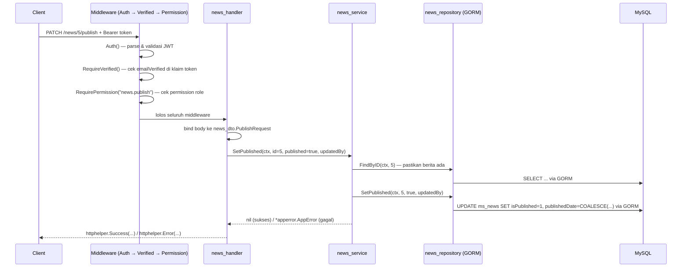

# Arsitektur & Alur Sistem — FSLDK API

[← Kembali ke README](../README.md) · [Lihat Panduan Instalasi →](./INSTALLATION.md)

Dokumen ini menjelaskan bagaimana `fsldk-api` disusun secara internal: pola berlapis (layered), struktur modul, alur permintaan (request lifecycle), dependency injection, serta konvensi yang dijaga konsisten di seluruh kode.

---

## 1. Filosofi Arsitektur

`fsldk-api` menerapkan arsitektur berlapis (layered architecture) standar:

```
Request  →  Middleware  →  Handler  →  Service  →  Repository (GORM)  →  MySQL
```

| Lapisan | Tanggung Jawab | Tidak Boleh |
|---|---|---|
| **Handler** | Menerima HTTP request, bind & validasi input, memanggil Service, membentuk response | Berisi logika bisnis atau query database |
| **Service** | Logika bisnis, aturan domain, orkestrasi antar-repository | Mengetahui detail HTTP (`gin.Context`) atau SQL |
| **Repository** | Akses data (CRUD) via GORM | Berisi logika bisnis |
| **Model** | Representasi baris tabel database (struct + tag `gorm`) | Method/function apa pun |
| **DTO** | Bentuk request/response API (struct + tag `json`/`validate`) | Method/function apa pun |

Aliran dependensi **selalu satu arah**: Handler → Service → Repository. Lapisan bawah tidak pernah tahu soal lapisan atas — ini menjaga setiap lapisan mudah diuji secara terpisah (unit test dengan mock interface).

---

## 2. Struktur Modul (Subfolder + Interface/Impl)

Setiap modul fitur (`auth`, `user`, `role`, `permission`, `news`, `article`, `event`, `comment`, `shortlink`, `dashboard`) memiliki struktur subfolder yang identik. Contoh modul `news`:

> Modul `upload` (unggah gambar/dokumen CMS, lihat §8) sengaja **tanpa** `_model`/`_repository` — tidak ada data yang disimpan ke database, hanya berkas ke disk lewat [`pkg/upload`](../pkg/upload) — sehingga hanya punya `upload_dto`, `upload_service`, `upload_handler`, `router.go`.

```
modules/news/
├── news_model/
│   └── news_model.go            # struct News, Category (murni data, tag gorm)
├── news_dto/
│   └── news_dto.go              # struct Request, Filter, PublishRequest, dst (tag json/validate)
├── news_repository/
│   ├── news_repository.go       # interface Repository (kontrak)
│   └── news_repository_impl.go  # RepositoryImpl — query GORM sesungguhnya
├── news_service/
│   ├── news_service.go          # interface Service (kontrak)
│   └── news_service_impl.go     # ServiceImpl — logika bisnis
├── news_handler/
│   ├── news_handler.go          # interface Handler (kontrak)
│   └── news_handler_impl.go     # HandlerImpl — binding & response HTTP
└── router.go                    # registrasi endpoint modul ini
```

### Aturan pemisahan struct vs. function

- **`_model/` dan `_dto/`** — **murni struct data**, tidak boleh ada function/method apa pun menempel. Field nullable pakai pointer (`*string`, `*time.Time`) atau `sql.NullXxx` dari `database/sql`. Kolom hasil `JOIN` yang read-only ditandai tag `` `gorm:"column:xxx;->"` `` (dilarang GORM tulis saat Create/Update).
- **`_handler/`, `_service/`, `_repository/`** — **murni logika**, tidak boleh mendeklarasikan struct data baru (kalau butuh bentuk data baru, taruh di `_dto`/`_model`). Satu-satunya pengecualian: struct `XxxImpl` di berkas `_impl.go` — itu bukan "data", melainkan *receiver* yang menyimpan dependency (mis. `repo Repository`) untuk method-method interface-nya, jadi memang harus digabung dengan method-nya di satu berkas (pola standar interface + implementation dalam Go).

Pola yang sama juga berlaku di luar `modules/` untuk komponen yang punya "identitas implementasi" sendiri — mis. `middlewares.Middleware`, `pkg/mailer.smtpMailer`, `pkg/googleauth.Verifier`. Sebaliknya, struct yang benar-benar data murni tanpa method (mis. `pkg/googleauth.Payload` — bentuk response JSON Google) tetap dipisah ke berkas tersendiri (`googleauth_model.go`).

---

## 3. Dependency Injection Manual

Dependensi antar-layer dirangkai secara manual di [`router.go`](../router.go) — bukan lewat code generator (mis. Google Wire) — sehingga tetap mudah dilacak tanpa perlu langkah build/codegen tambahan:

```go
// router.go (disederhanakan)
newsRepo := news_repository.NewRepository(db)        // Repository butuh *gorm.DB
newsSvc  := news_service.NewService(newsRepo)          // Service butuh Repository
newsH    := news_handler.NewHandler(newsSvc)            // Handler butuh Service

news.RegisterPublicRoutes(pub, newsH)                    // publik: tanpa auth
news.RegisterCMSRoutes(api, newsH, mw)                    // CMS: auth+verified+permission
```

Semua `New...()` (`NewRepository`, `NewService`, `NewHandler`) mengembalikan **interface**, bukan struct konkret — sehingga lapisan pemanggil (mis. `middlewares.RequirePermission`, atau nantinya unit test) cukup bergantung pada kontrak, bukan implementasi.

---

## 4. Alur Permintaan (Request Lifecycle)

Contoh: `PATCH /api/v1/news/:id/publish` (mempublikasikan berita).



---

## 5. Middleware Chain

Didefinisikan di [`middlewares/`](../middlewares), dipasang berlapis per grup route:

| Middleware | Fungsi | Dipasang Global/Per-Route |
|---|---|---|
| `Recovery()` | Menangkap panic → response 500 rapi (bukan crash) | Global (`engine.Use`) |
| `CORS(cfg)` | Whitelist origin dari `CORS_ALLOWED_ORIGINS` | Global |
| `RateLimit(perMenit, burst)` | Token-bucket per-IP, angka berbeda per endpoint sensitif (login 5/menit, register 5/10menit, dst.) | Per-route (`auth.go`) |
| `Auth()` | Parse & validasi JWT access token, simpan identitas ke `gin.Context` | Per-grup (route terproteksi) |
| `RequireVerified()` | Tolak (403 `EMAIL_NOT_VERIFIED`) bila email belum diverifikasi | Setelah `Auth()`, kecuali endpoint di "daftar aman" |
| `RequirePermission(code)` | Tolak (403) bila role tidak punya permission tsb. — query `map_role_permission` via `PermissionLoader` (diimplementasikan modul `permission`, di-inject untuk menghindari circular dependency) | Per-endpoint CMS |
| `LoadPermissions()` | Memuat seluruh kode permission milik role pengguna ke context **tanpa pernah menolak request** (beda dari `RequirePermission`, yang menolak bila kode tertentu tidak dimiliki) — dipakai pada route "milik-sendiri" yang otorisasinya bercabang antara pemilik konten ATAU pemegang permission tertentu, mis. `PUT/DELETE /comments/:id` (owner ATAU `comment.update`/`comment.delete` — cek final di service, lihat §11) | Per-endpoint milik-sendiri yang punya jalur override moderator |

---

## 6. Konsep Autentikasi

Mengadaptasi pola `ldksyahid-app`: **tidak ada kolom `authProvider`**. Metode autentikasi ditentukan dari ada/tidaknya nilai pada kolom `password` dan `googleID` di `ms_user` — satu akun bisa punya keduanya (dual-login).

| Jalur | Alur |
|---|---|
| **Registrasi mandiri** | `POST /auth/register` → akun dibuat dengan `emailVerifiedDate = NULL` → email verifikasi dikirim (tautan 60 menit) → `GET /auth/email/verify/:token` mengisi `emailVerifiedDate` |
| **Login lokal** | `POST /auth/login` → verifikasi bcrypt → JWT diterbitkan (klaim `emailVerified` sesuai status saat itu) |
| **Login Google** | `POST /auth/google` (kirim ID Token) → verifikasi ke Google (`GOOGLE_TOKENINFO_URL`) → 3 kondisi: (1) `googleID` cocok → login langsung; (2) email cocok akun lokal → auto-link + tandai terverifikasi; (3) tidak cocok → auto-provision akun baru, langsung terverifikasi |

JWT access token membawa klaim `userID`, `roleID`, `roleName`, `emailVerified` (lihat [`base/token`](../base/token)) — dipakai middleware tanpa perlu query ulang ke database di setiap request (kecuali untuk cek permission, yang memang harus real-time agar perubahan role langsung berlaku).

---

## 7. Standar Response & Error

Seluruh endpoint mengembalikan amplop (envelope) seragam via [`base/httphelper`](../base/httphelper):

```json
{
  "path": "https://api.../api/v1/news/5",
  "timestamp": "2026-08-01 20:15:03",
  "status": "ok",
  "code": "00",
  "message": "Ok",
  "result": { "...": "..." },
  "errors": null
}
```

Error dibentuk lewat tipe terstruktur [`base/apperror.AppError`](../base/apperror) (`apperror.NotFound(...)`, `apperror.Forbidden(...)`, dst.) yang otomatis dipetakan `httphelper.Error()` ke status HTTP & kode yang sesuai — handler cukup `return apperror.NotFound("...")`, tidak perlu tahu detail HTTP status code secara eksplisit.

---

## 8. Pemuatan Aset Runtime

Berbeda dari kebanyakan aset Go yang di-*embed* ke binary (`go:embed`), folder [`assets/`](../assets) memakai pola **`os.ReadFile` saat runtime**, sehingga template email & logo bisa diedit tanpa build ulang aplikasi:

```go
// pkg/mailer/mailer.go
path := filepath.Join("assets", "email_template", assetName+".html")
templateData, _ := os.ReadFile(path)
```

**Konsekuensi:** binary harus dijalankan dari root proyek (atau `assets/` disalin bersebelahan dengan binary saat deploy) — lihat [Instalasi §10](./INSTALLATION.md#10-build-untuk-produksi). Keuntungannya: template email & logo bisa diedit tanpa build ulang aplikasi.

`assets/uploads/` memakai pola serupa untuk sisi tulis: [`pkg/upload`](../pkg/upload) (dipakai lewat modul `upload`, `POST /uploads/image`, lihat [API §7](./API.md)) menyimpan gambar unggahan CMS (Artikel & Berita) ke folder ini dengan nama acak, lalu [`router.go`](../router.go) menyajikannya sebagai berkas statis publik lewat `engine.Static("/uploads", "./assets/uploads")`. Folder ini diabaikan git (`.gitignore`) karena isinya data runtime, bukan aset sumber.

---

## 9. Migration & Seed

[`migrations/`](../migrations) berisi berkas `.up.sql` yang di-*embed* ke binary (`go:embed *.up.sql`) dan dijalankan berurutan oleh [`migrations.Run()`](../migrations/migrate.go), dicatat di tabel `schema_migrations` agar idempoten (aman dijalankan berkali-kali, hanya migration baru yang dieksekusi):

| Berkas | Isi |
|---|---|
| `0001_init.up.sql` | Skema seluruh tabel (`ms_*`, `lk_*`, `map_*`, `tr_*`) |
| `0002_seed.up.sql` | Role bawaan (Super Admin/Editor/Kontributor), permission + atribut menu, kategori berita/artikel |
| `0003_seed_admin.up.sql` | 1 akun Super Admin awal (kredensial di [Instalasi §7](./INSTALLATION.md#7-kredensial-admin-fsldk-bawaan)) |
| `0004_shortlink.up.sql` | Tabel `ms_shortlink` + permission `shortlink.*` + pemetaan ke role Super Admin/Editor |
| `0005_comment.up.sql` | Tabel `ms_comment` + `tr_comment_reaction`; role `Member` (pendaftar publik, tanpa akses CMS); permission `comment.view`/`comment.delete` → Super Admin & Editor |
| `0005_event.up.sql` | Tabel `ms_event` + permission `event.*` → Super Admin & Editor |
| `0006_comment_update_permission.up.sql` | Permission `comment.update` (moderasi edit komentar bukan-pemilik, lihat §11) → Super Admin & Editor |
| `0007_comment_mention.up.sql` | Tabel `tr_comment_mention` (@mention terstruktur pada komentar, lihat §11) |

`0005_comment.up.sql` dan `0005_event.up.sql` sengaja berbagi nomor urut yang sama (ditambahkan independen oleh pekerjaan berbeda) — ini aman karena `migrations.Run()` mengurutkan berdasarkan **nama file lengkap** (alfabetis: `comment` < `event`) dan mencatat status penerapan per nama file di `schema_migrations`, bukan per nomor urut semata.

Menambahkan fitur baru setelah 0001/0002 sudah pernah diterapkan (seperti `0004_shortlink.up.sql` dst.) berarti tabel **dan** baris permission/pemetaan role-nya harus ada di migration baru itu sendiri — mengedit 0001/0002 langsung tidak akan berpengaruh ke database yang sudah menjalankannya.

**Pengecualian selama masa pra-peluncuran** (belum ada data produksi): perubahan skema tabel yang sifatnya konseptual — mis. modul `content` yang dihapus total, kolom `ms_article` (`articleExcerpt` dihapus, `articleContent`→`articleIntro`, tambah `articleWriter`/`articleEditor`/`articlePdf`), atau kolom `ms_news` (tambah `newsPublisher`/`newsReporter`/`newsEditor`) — langsung diedit di `0001_init.up.sql` itu sendiri (bukan migration baru), lalu skema database dev yang sudah berjalan disesuaikan manual lewat `ALTER TABLE`. Ini sengaja dilakukan supaya *fresh install* tetap mencerminkan skema final tanpa riwayat migration yang saling menimpa satu sama lain untuk fitur yang belum pernah dipakai siapa pun di produksi. Begitu aplikasi live dengan data nyata, pola ini **tidak berlaku lagi** — semua perubahan skema wajib lewat migration baru.

Tidak ada logika seed di kode Go (`EnsureSuperAdmin` dkk. sudah dihapus) — **migration SQL adalah satu-satunya sumber kebenaran** untuk struktur & data awal, konsisten dengan filosofi "migration-driven schema".

---

## 10. Menu Sidebar CMS Dinamis

Sidebar CMS **tidak hardcode**. Item menu (selain Dashboard) diambil dari `GET /me/menus`, yang meng-query `lk_permission` (kolom `menuLabel`/`menuIcon`/`menuRoute`/`sortOrder`) di-`JOIN` `map_role_permission` sesuai role pengguna yang login — lihat [`modules/permission`](../modules/permission). Permission yang tidak berelasi ke menu (`menuRoute IS NULL`) tidak pernah muncul sebagai item menu.

---

## 11. Komentar: Kedalaman Balasan, Moderasi, dan @Mention

Modul `comment` (dipakai bersama oleh Artikel, Berita, dan Event — `contentType`/`contentID` generik tanpa FK, lihat `comment_model.ValidContentTypes`) punya tiga aturan bisnis yang tidak terlihat langsung dari skema tabel:

**Kedalaman balasan dibatasi 1 level.** `ms_comment.parentID` adalah self-reference tanpa kolom `depth` maupun CHECK constraint — kedalaman dihitung on-the-fly oleh `comment_repository.DepthOf` (jalan ke atas lewat `parentID`), dan aturan "hanya 1 level" ditegakkan di `comment_service.Create`: membalas komentar yang `DepthOf >= 1` (sudah berupa balasan) ditolak dengan `apperror.Validation`. Artinya struktur datanya sanggup menampung nesting tak terbatas, tapi bisnisnya sengaja membatasi jadi flat: komentar root → balasan (1 level), tanpa balasan-atas-balasan.

**Edit/hapus: pemilik selalu boleh, selain itu berdasar permission.** `comment_service.Update`/`Delete` menerima parameter `isModerator bool`; otorisasinya `pemilik (createdBy == userID) OR isModerator`. `isModerator` diisi handler dari `constants.PermCommentUpdate`/`PermCommentDelete` pada context — tapi context itu **hanya** terisi kalau middleware `LoadPermissions()` (§5) dipasang di route yang bersangkutan (dipasang di `PUT/DELETE /comments/:id`, bukan `RequirePermission` biasa karena rute ini tidak boleh menolak pemilik komentar yang kebetulan tidak punya permission tsb.). Permission `comment.update`/`comment.delete` sengaja *action-only* (`menuRoute IS NULL`) — tidak muncul sebagai item sidebar, hanya sebagai checklist di halaman Role Management yang mengontrol jalur moderator ini.

**@Mention disimpan terstruktur, bukan di-parse dari teks.** Tabel `tr_comment_mention` (commentID + userID, `0007_comment_mention.up.sql`) mencatat persis siapa saja yang dipilih composer lewat autocomplete `GET /users/mention-search` (endpoint ini sengaja tanpa permission — cukup login+verified, siapa pun boleh dicari & memilih mention siapa pun termasuk dirinya sendiri). `CreateRequest`/`UpdateRequest` membawa `mentionedUserIDs []int64`; `comment_service` menulis ulang seluruh daftar mention lewat `SetMentions` (delete-then-insert) setiap kali komentar dibuat/diubah, lalu `Response.mentions` mengembalikannya sebagai `[]AuthorDTO` (userID/name/photo). Desain ini sengaja **tidak** menyimpan tanda `@` di dalam `commentText` sebagai delimiter mention (mis. `@{Nama}`) — parsing bebas seperti itu ambigu untuk nama multi-kata dan gampang salah cocok; klien merender pill mention dengan mencocokkan `commentText` terhadap daftar `mentions` yang sudah pasti benar, bukan menebak dari pola teks (lihat `fsldk-web` — `MentionHighlightPipe`).

---

## Referensi Terkait

- [Panduan Instalasi](./INSTALLATION.md) — langkah menjalankan server dari nol
- [Referensi API](./API.md) — kontrak endpoint lengkap (request/response, permission, rate limit)

---

[← Kembali ke README](../README.md) · [Lihat Panduan Instalasi →](./INSTALLATION.md)
